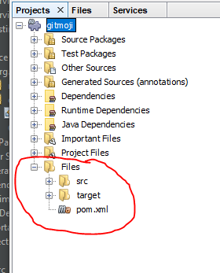

# Show other files in project view

This plugin is inspired by [Display readme files in project view (And many more)](https://github.com/Chris2011/readmeinprojectview)
It adds a new node (Files) into Project View where are all files in project folder.

